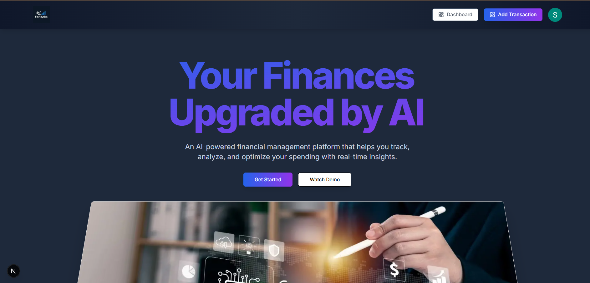
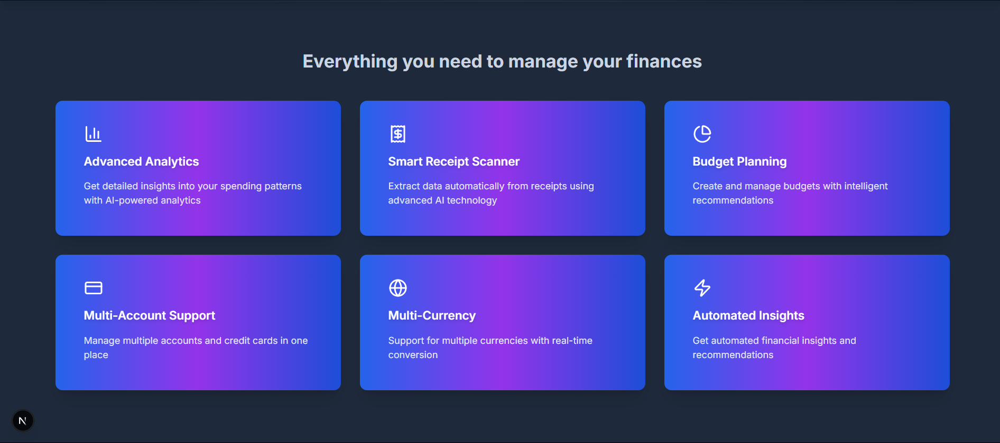
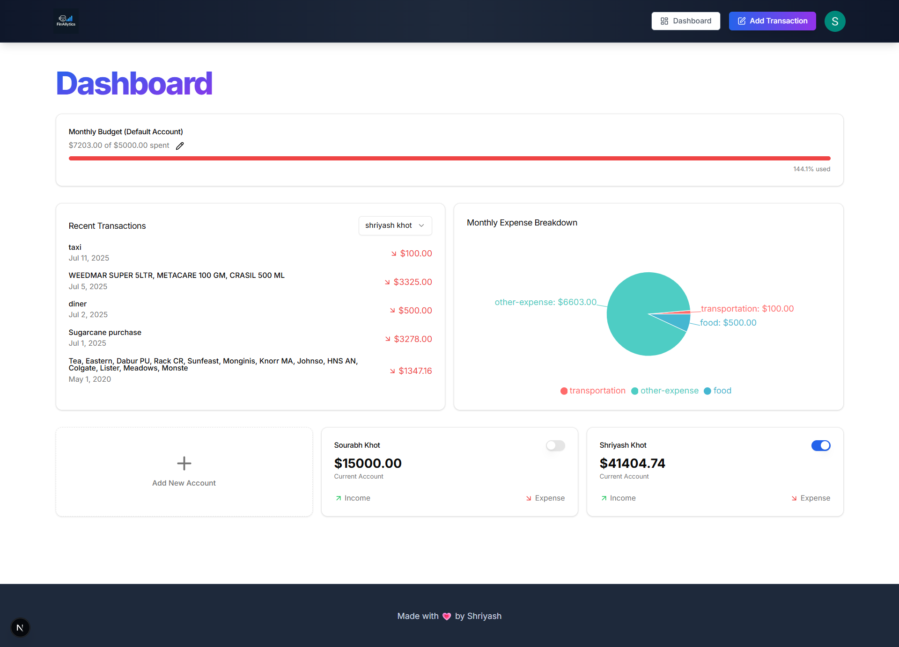
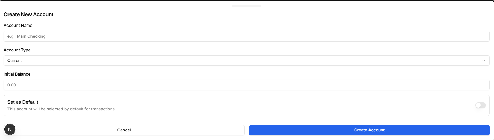
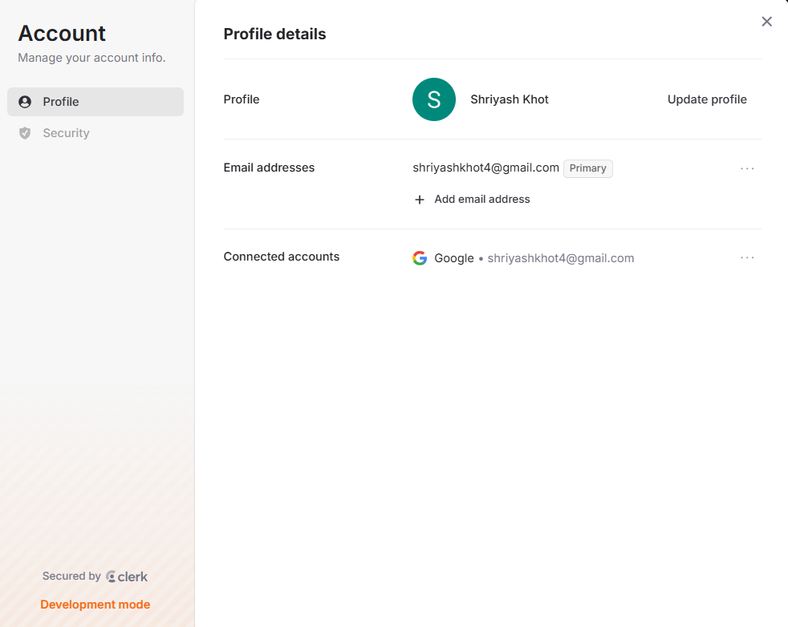
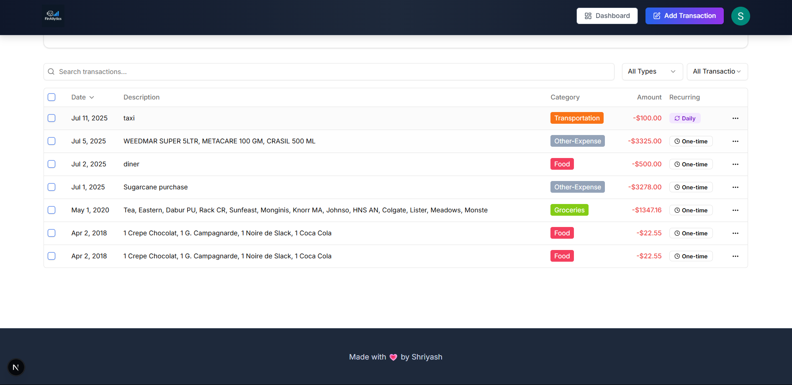
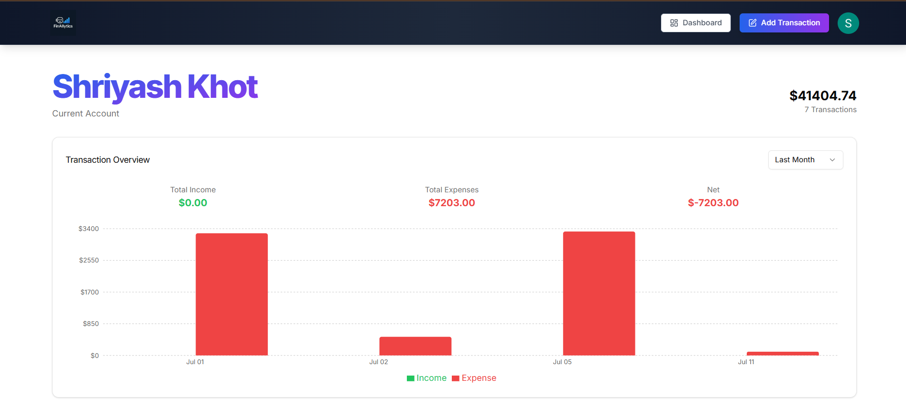

# 🧠 AI Finance Platform

An AI-powered personal finance dashboard built with **React**, **Next.js**, and **Tailwind CSS**.  
Track multiple bank accounts, auto-scan receipts using AI, create recurring transactions, and get monthly finance reports — all in one place.


---

## 🚀 Features

- ✅ Multi-account support to manage all your bank accounts
- 🧾 AI receipt scanning (Gemini API) — auto-extracts and categorizes expenses
- 🔄 Recurring transactions with automated scheduling
- 📊 Real-time interactive charts (income vs. expense)
- 📩 Automated monthly financial reports sent via email (Resend)
- ⚠️ Budget alerts and intelligent insights
- 🔐 Secure authentication with Clerk (Google & email/password)
- ☁️ Serverless & scalable architecture

---

## 🧰 Tech Stack

| Layer             | Tech                                                                 |
| ----------------- | -------------------------------------------------------------------- |
| Frontend          | React, Next.js 15, Tailwind CSS, shadcn/ui                           |
| Backend / DB      | PostgreSQL (via Prisma), Supabase                                    |
| AI Integration    | Gemini API                                                           |
| Auth              | Clerk                                                                 |
| Jobs / Scheduling | Inngest                                                               |
| Emails            | Resend API                                                            |
| Security          | Arcjet (rate limiting & protection)                                   |

---

## 📦 Installation & Setup

1. **Clone the repository:**
```bash
git clone https://github.com/shriyash04/ai-personal-finance-manager.git
cd ai-personal-finance-manager

2. Install dependencies:

   npm install
   # or
   yarn install


3. Setup environment variables:
   Create a .env file and add:

    CLERK_SECRET_KEY=your_key
    NEXT_PUBLIC_CLERK_PUBLISHABLE_KEY=your_key
    DATABASE_URL=postgres://...
    GEMINI_API_KEY=your_key
    RESEND_API_KEY=your_key
    SUPABASE_URL=your_url
    SUPABASE_ANON_KEY=your_key
    ARCJET_API_KEY=your_key

4.Run locally:
    npm run dev

📄 Usage.

    Log in with Google or email.

    Connect and manage your bank accounts.

    Upload receipts → AI auto-scans and logs them.

    Set budget alerts & create recurring transactions.

    View dynamic charts & export monthly finance reports.


## 📸 Screenshots

### ✨ Landing Page



---

### 📊 Dashboard


---

### ➕ Add Account Page


---

### 🔄 Manage Accounts


---

### 📁 Manage All Transactions


---

### 📈 Transaction Chart


---

### 🧾 Transaction Page

    


